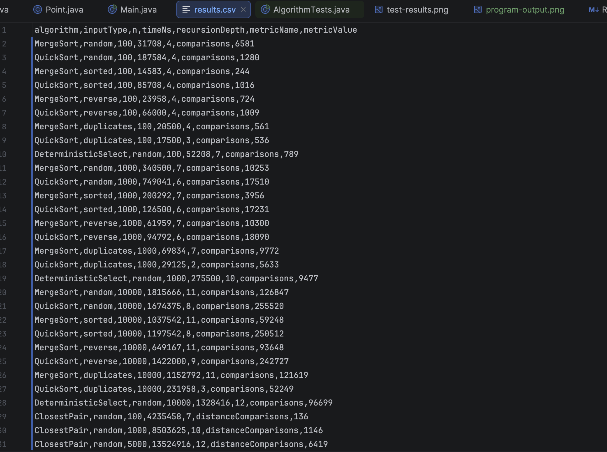
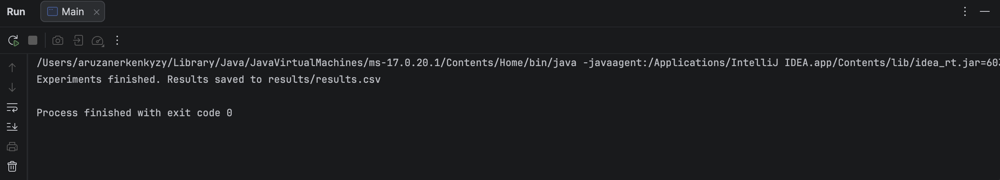

# Assignment 1: Divide-and-Conquer Algorithm Analysis

## A. Project Overview

This project implements and analyzes four divide-and-conquer algorithms in Java:

- Merge Sort
- Randomized Quick Sort
- Deterministic Select (Median of Medians)
- Closest Pair of Points

The project measures execution time, maximum recursion depth, and algorithm-specific operation counts. Experimental results are stored in CSV format and compared with theoretical complexity.

Repository: https://github.com/aerkenovva/assignment1-divide-and-conquer

---

## B. Algorithm Analysis

### 1. Merge Sort

Merge Sort recursively divides an array into two halves, sorts both halves, and combines them using a linear merge.

Implementation features:

- Linear merge
- Reusable auxiliary buffer
- Insertion Sort cutoff for small subarrays
- Comparison counting
- Maximum recursion-depth measurement

Recurrence:

`T(n) = 2T(n/2) + Θ(n)`

Using the Master Theorem:

`T(n) = Θ(n log n)`

Time complexity:

- Best: `Θ(n log n)`
- Average: `Θ(n log n)`
- Worst: `Θ(n log n)`

Space complexity:

`Θ(n)` auxiliary memory.

---

### 2. Randomized Quick Sort

Quick Sort selects a randomized pivot and partitions the array in place.

The implementation uses three-way partitioning, which is useful for duplicate-heavy inputs because values smaller than, equal to, and greater than the pivot are grouped separately.

The algorithm recursively processes only the smaller partition and handles the larger partition iteratively.

General recurrence:

`T(n) = T(k) + T(n-k-1) + Θ(n)`

For reasonably balanced partitions:

`T(n) = Θ(n log n)`

Worst case:

`T(n) = T(n-1) + Θ(n) = Θ(n²)`

Time complexity:

- Expected: `Θ(n log n)`
- Worst: `O(n²)`

Recursion stack depth:

`O(log n)` because recursion is applied only to the smaller partition.

---

### 3. Deterministic Select (Median of Medians)

Deterministic Select finds the k-th smallest element without sorting the complete array.

The implementation:

- Divides elements into groups of 5
- Sorts each group
- Finds the median of each group
- Recursively selects the median of medians
- Uses it as the pivot
- Partitions the array in place
- Recurses only into the partition containing the required element

Approximate recurrence:

`T(n) ≤ T(n/5) + T(7n/10) + Θ(n)`

Using divide-and-conquer and Akra-Bazzi intuition, the recursive subproblems shrink sufficiently while the partitioning work remains linear.

Therefore:

`T(n) = Θ(n)`

Worst-case time complexity:

`Θ(n)`

---

### 4. Closest Pair of Points

The Closest Pair algorithm finds the two points with the minimum Euclidean distance.

Steps:

1. Sort points by x-coordinate and y-coordinate.
2. Divide the points into left and right halves.
3. Recursively find the closest pair in both halves.
4. Choose the better of the two recursive results.
5. Construct a strip around the dividing line.
6. Check possible closer pairs using y-order.

Recurrence:

`T(n) = 2T(n/2) + Θ(n)`

Using the Master Theorem:

`T(n) = Θ(n log n)`

This is asymptotically faster than the brute-force solution:

`Θ(n²)`

---

## C. Experimental Results

Experiments were performed using Java's `System.nanoTime()`.

### Input Sizes

Array algorithms were tested with:

- `n = 100`
- `n = 1,000`
- `n = 10,000`

Closest Pair was tested with:

- `n = 100`
- `n = 1,000`
- `n = 5,000`

### Sorting Input Types

Merge Sort and Quick Sort were tested on:

- Random input
- Sorted input
- Reverse-sorted input
- Duplicate-heavy input

### Measured Metrics

The experiments recorded:

- Execution time
- Maximum recursion depth
- Number of comparisons or distance comparisons

The complete experimental dataset is available in:

`results/results.csv`

### Selected Results from Random Inputs

| Algorithm | n | Time (ns) | Max Recursion Depth | Metric |
|---|---:|---:|---:|---:|
| MergeSort | 100 | 31,708 | 4 | 658 comparisons |
| MergeSort | 1,000 | 340,500 | 7 | 10,253 comparisons |
| MergeSort | 10,000 | 1,815,666 | 11 | 126,847 comparisons |
| QuickSort | 100 | 187,584 | 4 | 1,280 comparisons |
| QuickSort | 1,000 | 749,041 | 6 | 17,510 comparisons |
| QuickSort | 10,000 | 1,674,375 | 8 | 255,520 comparisons |
| Deterministic Select | 100 | 52,208 | 7 | 789 comparisons |
| Deterministic Select | 1,000 | 275,500 | 10 | 9,477 comparisons |

Because execution time varies between runs, `results/results.csv` should be treated as the complete source of the final measured values.

### Execution Time vs Input Size


### Recursion Depth vs Input Size


### Experimental Results Preview



---

## D. Discussion

### Do the results match theoretical complexity?

Overall, the results are consistent with the expected theoretical behavior.

Merge Sort shows logarithmic growth in recursion depth while its operation count grows approximately according to `n log n`.

Quick Sort also maintains low recursion depth because only the smaller partition is processed recursively.

Deterministic Select shows approximately linear growth in its comparison count as input size increases.

Closest Pair performs substantially fewer distance comparisons than an `O(n²)` brute-force method would require for large datasets.

Execution time does not perfectly follow theoretical complexity because practical measurements are affected by JVM behavior and the execution environment.

---

### How does input structure affect performance?

Merge Sort retains `Θ(n log n)` asymptotic complexity regardless of input ordering, although the actual number of comparisons and execution time may vary.

Randomized Quick Sort reduces dependence on the original ordering because the pivot is selected randomly.

Duplicate-heavy input can perform particularly well with three-way partitioning because all elements equal to the pivot are handled together and do not need to appear in future recursive partitions.

---

### Why does smaller-first recursion help QuickSort?

After partitioning, the implementation recursively processes the smaller partition and handles the larger partition using iteration.

The recursively processed partition can contain at most about half of the current elements.

Therefore, the recursive call stack remains bounded by approximately:

`O(log n)`

This reduces stack usage and the risk of `StackOverflowError` on the JVM.

---

### Why does Median of Medians guarantee O(n)?

Median of Medians chooses a pivot that guarantees that a significant fraction of elements can be discarded after each partition.

The recurrence can be represented as:

`T(n) ≤ T(n/5) + T(7n/10) + Θ(n)`

The recursive subproblems together remain sufficiently smaller than the original problem, while the remaining work is linear.

Therefore:

`T(n) = Θ(n)`

in the worst case.

---

### Why is divide-and-conquer Closest Pair faster than O(n²)?

A brute-force algorithm compares every pair of points, requiring:

`Θ(n²)`

comparisons.

The divide-and-conquer solution recursively solves two smaller problems and only checks points inside a narrow strip around the dividing line.

This reduces the total complexity to:

`Θ(n log n)`

which becomes significantly more efficient as the dataset grows.

---

### Practical Performance Factors

Real execution time can be influenced by:

- JVM warm-up
- JIT compilation
- Garbage collection
- CPU cache behavior
- Memory allocation
- Branch prediction
- Background operating-system activity
- Random pivot selection in Quick Sort

For this reason, a single execution-time measurement should not be interpreted as an exact representation of asymptotic complexity.

---

## E. Reflection

This assignment helped me understand how divide-and-conquer algorithms behave both theoretically and practically. Implementing the algorithms made recurrence relations, recursive decomposition, and recursion depth easier to understand because I could observe how problem sizes decrease during execution.

One of the main challenges was implementing the algorithms while satisfying both correctness and performance requirements. In particular, smaller-first recursion in Quick Sort, Median-of-Medians pivot selection, and the strip step in Closest Pair required careful implementation. The experiments also demonstrated that practical JVM execution time can vary even when the theoretical complexity remains unchanged.

---

## F. Testing

### Merge Sort and Quick Sort

Both sorting algorithms were compared against Java's `Arrays.sort()`.

The tests included:

- Random arrays
- Sorted arrays
- Reverse-sorted arrays
- Duplicate-heavy arrays
- Empty arrays
- Single-element arrays

### Deterministic Select

Deterministic Select was verified using at least 100 random tests.

For each test, the selected element was compared with:

`Arrays.sort(array)[k]`

### Closest Pair

The divide-and-conquer solution was compared with an `O(n²)` brute-force implementation on small random datasets.

All implemented correctness tests passed.

### Test Results


### Program Output



---

## Project Structure

```text
assignment1-divide-and-conquer/
├── src/
│   ├── main/
│   │   └── java/
│   │       ├── MergeSorter.java
│   │       ├── QuickSorter.java
│   │       ├── DeterministicSelector.java
│   │       ├── ClosestPairSolver.java
│   │       ├── Experiment.java
│   │       ├── Point.java
│   │       └── Main.java
│   └── test/
│       └── java/
│           └── AlgorithmTests.java
├── docs/
│   ├── screenshots/
│   │   ├── program-output.png
│   │   ├── results-preview.png
│   │   └── test-results.png
│   └── plots/
│       ├── time-vs-n.png
│       └── recursion-depth-vs-n.png
├── results/
│   └── results.csv
├── README.md
├── pom.xml
└── .gitignore
```

---

## Technologies

- Java 17
- Maven
- IntelliJ IDEA
- Git
- GitHub

---

## AI Usage Disclosure

AI assistance was used for explanations, debugging guidance, code review, and documentation support. All implementations were tested and reviewed as part of the assignment work.