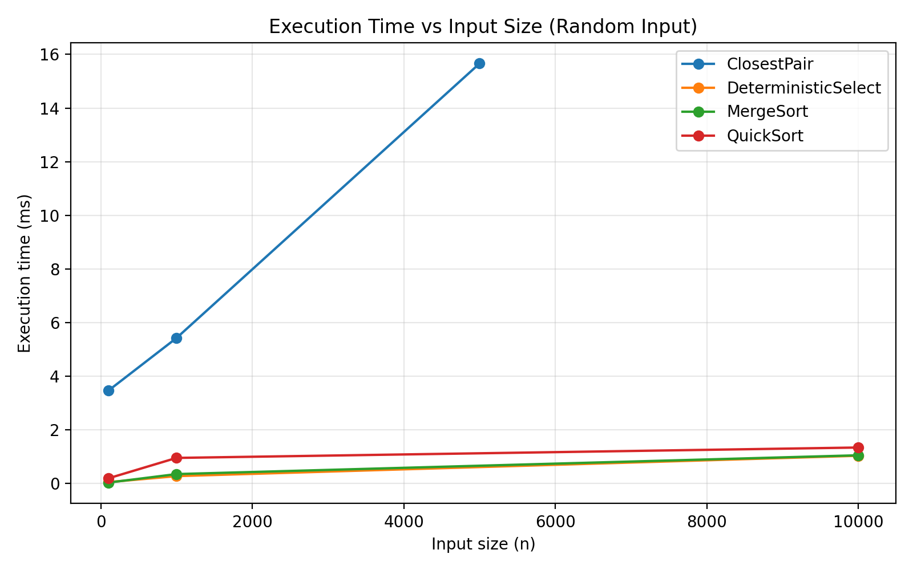
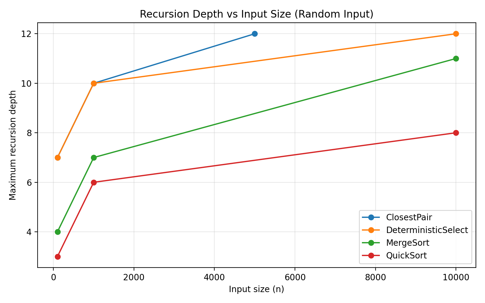
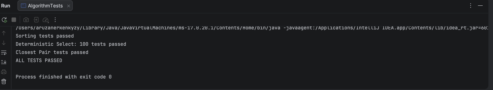

# Assignment 1: Divide-and-Conquer Algorithm Analysis

## A. Project Overview

This project implements and analyzes four divide-and-conquer algorithms in Java:

- Merge Sort
- Randomized Quick Sort
- Deterministic Select (Median of Medians)
- Closest Pair of Points

The project measures execution time, maximum recursion depth, and algorithm-specific operation counts. Experimental results are stored in CSV format and compared with theoretical complexity.

---

## B. Algorithm Analysis

### 1. Merge Sort

Merge Sort recursively divides the array into two halves, sorts both halves, and combines them using a linear merge.

Implementation features:

- Linear merge
- Reusable auxiliary buffer
- Insertion Sort cutoff for small subarrays
- Comparison counting
- Recursion-depth measurement

Recurrence:

`T(n) = 2T(n/2) + Θ(n)`

Using the Master Theorem:

`T(n) = Θ(n log n)`

Time complexity:

- Best: Θ(n log n)
- Average: Θ(n log n)
- Worst: Θ(n log n)

Space complexity:

`Θ(n)` auxiliary memory.

---

### 2. Randomized Quick Sort

Quick Sort selects a randomized pivot and partitions the array in place.

This implementation uses three-way partitioning, which is especially useful when the input contains many duplicate values.

It recursively processes only the smaller partition and iterates over the larger partition. This limits stack usage.

Typical recurrence:

`T(n) = T(k) + T(n-k-1) + Θ(n)`

For reasonably balanced partitions:

`T(n) = Θ(n log n)`

Worst case:

`T(n) = T(n-1) + Θ(n) = Θ(n²)`

Time complexity:

- Expected: Θ(n log n)
- Worst: O(n²)

Typical recursion stack depth:

`O(log n)` because the algorithm recurses only on the smaller partition.

---

### 3. Deterministic Select (Median of Medians)

The algorithm finds the k-th smallest element without sorting the entire array.

The implementation:

- Divides elements into groups of 5
- Sorts each small group
- Finds group medians
- Recursively selects the median of medians
- Uses it as a pivot
- Partitions the array in place
- Recurses only into the partition containing the required element

The recurrence can be described approximately as:

`T(n) ≤ T(n/5) + T(7n/10) + Θ(n)`

Using divide-and-conquer / Akra-Bazzi intuition, the recursive subproblems shrink sufficiently while partitioning remains linear.

Therefore:

`T(n) = Θ(n)`

Worst-case time complexity:

`Θ(n)`

---

### 4. Closest Pair of Points

The algorithm finds the two points with minimum Euclidean distance.

Steps:

1. Sort points by x-coordinate and y-coordinate.
2. Divide the points into left and right halves.
3. Recursively find the closest pair in each half.
4. Build a strip around the dividing line.
5. Check possible closer pairs using y-order.

Recurrence:

`T(n) = 2T(n/2) + Θ(n)`

Using the Master Theorem:

`T(n) = Θ(n log n)`

This is asymptotically faster than the brute-force approach:

`Θ(n²)`

---

## C. Experimental Results

Experiments were performed using `System.nanoTime()`.

Input sizes for array algorithms:

- 100
- 1,000
- 10,000

Sorting input types:

- Random
- Sorted
- Reverse-sorted
- Duplicate-heavy

Closest Pair sizes:

- 100
- 1,000
- 5,000

Full results are available in:

`results/results.csv`

### Selected Random-Input Results

| Algorithm | n | Time (ns) | Max Recursion Depth | Metric |
|---|---:|---:|---:|---:|
| MergeSort | 100 | 32,958 | 4 | 658 comparisons |
| MergeSort | 1,000 | 350,625 | 7 | 10,253 comparisons |
| MergeSort | 10,000 | 1,051,916 | 11 | 126,847 comparisons |
| QuickSort | 100 | 191,583 | 3 | 1,134 comparisons |
| QuickSort | 1,000 | 953,958 | 6 | 19,796 comparisons |
| QuickSort | 10,000 | 1,341,333 | 8 | 250,162 comparisons |
| Deterministic Select | 100 | 50,958 | 7 | 789 comparisons |
| Deterministic Select | 1,000 | 275,209 | 10 | 9,477 comparisons |
| Deterministic Select | 10,000 | 1,034,583 | 12 | 96,699 comparisons |
| Closest Pair | 100 | 3,460,166 | 7 | 136 distance comparisons |
| Closest Pair | 1,000 | 5,423,833 | 10 | 1,146 distance comparisons |
| Closest Pair | 5,000 | 15,659,250 | 12 | 6,419 distance comparisons |

### Execution Time Plot



### Recursion Depth Plot



---

## D. Discussion

### Do the experimental results match theoretical complexity?

In general, the operation counts and recursion-depth growth are consistent with the expected theoretical behavior.

Merge Sort recursion depth grows logarithmically as the input size increases.

Quick Sort also maintains relatively low recursion depth because the implementation recursively processes only the smaller partition.

Deterministic Select shows approximately linear growth in the number of comparisons as the input size increases.

Closest Pair performs much fewer pair comparisons than a brute-force `O(n²)` solution would require for large inputs.

Execution time does not perfectly follow theoretical complexity because actual timing is affected by JVM warm-up, JIT compilation, memory allocation, caching, garbage collection, and system activity.

### How does input structure affect performance?

Merge Sort has similar asymptotic complexity for all input structures, although the number of comparisons and practical execution time can vary.

Randomized Quick Sort reduces dependence on the original ordering of the input because the pivot is selected randomly.

Duplicate-heavy input performs particularly well with the implemented three-way partitioning because elements equal to the pivot are grouped together.

### Why does smaller-first recursion help QuickSort?

After partitioning, the implementation recursively processes the smaller partition and handles the larger partition iteratively.

Because the recursively processed partition is at most a fraction of the previous problem, the recursion stack remains bounded by approximately `O(log n)` even when partitions are unbalanced.

This reduces the risk of `StackOverflowError` on the JVM.

### Why does Median of Medians guarantee O(n)?

Median of Medians chooses a pivot that guarantees that a significant fraction of elements can be discarded after every partition.

Therefore, the recursive problem size decreases sufficiently at every step.

The recurrence

`T(n) ≤ T(n/5) + T(7n/10) + Θ(n)`

has a linear solution:

`Θ(n)`.

### Why is divide-and-conquer Closest Pair faster than O(n²)?

The brute-force method compares every pair of points.

Divide-and-conquer eliminates most pair comparisons by solving two smaller subproblems and checking only a narrow strip near the dividing line.

This reduces the running time from:

`Θ(n²)`

to:

`Θ(n log n)`.

### Practical performance factors

Measured running time may be affected by:

- JVM JIT compilation
- JVM warm-up
- Garbage collection
- CPU cache behavior
- Memory allocation
- Branch prediction
- Background operating-system processes
- Random pivot selection

Because of these factors, a single timing measurement should not be interpreted as an exact representation of asymptotic complexity.

---

## E. Reflection

This assignment helped me understand how divide-and-conquer algorithms behave both theoretically and practically. Implementing the algorithms made recurrence relations and recursion depth easier to understand because I could observe how the problem size decreases during execution.

One of the main challenges was implementing the algorithms in a way that satisfies both correctness and performance requirements. In particular, smaller-first recursion in Quick Sort, the Median-of-Medians pivot selection, and the strip step in Closest Pair required careful implementation. The experiments also showed that practical JVM execution time can vary even when the theoretical complexity remains the same.

---

## F. Testing

Merge Sort and Quick Sort were compared against Java's `Arrays.sort()`.

The tests included:

- Random arrays
- Sorted arrays
- Reverse-sorted arrays
- Duplicate-heavy arrays
- Empty arrays
- Single-element arrays

Deterministic Select was verified using 100 random tests by comparing its result with the corresponding element in a sorted copy of the array.

Closest Pair was compared with a brute-force implementation on small random datasets.

All implemented correctness tests passed.

### Test Results



---

## Project Structure

```text
assignment1-divide-and-conquer/
├── src/
│   ├── main/
│   │   └── java/
│   └── test/
├── docs/
│   ├── screenshots/
│   └── plots/
├── results/
│   └── results.csv
├── README.md
├── pom.xml
└── .gitignore